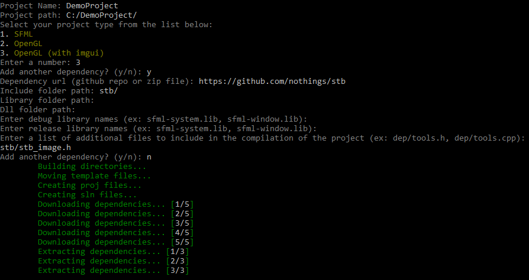

# VS-CPP-Project-Generator
  <br/>
Fully functional C++ project generator for Visual Studio. Supports three built in project templates and lets you add an unlimited number of external dependencies that can be downloaded from zip files (www.somewebsite/myzipfile.zip) or github repositories. 
<br/>Built in project templates are:
* SFML
* OpenGL
* OpenGL (with imgui)
### Example Usage
In the following example, I create a project called "DemoProject" using the OpenGL template that supports ImGui. I also needed STB image in this example so added a custom dependecny for it.<br/><br/>
<br/><br/>
Once the project has finished being created, a folder containing the solution file will be automaticly opened.<br/><br/>
<br/><br/>
### Adding Custom Templates
If you want to add your own template, it is very easy to do so, but will take some modification of the source code. Use these steps to add your custom template:
1. Download the source code throught GitHub or through the command line via `git clone https://github.com/Alex-Sindledecker/VS-CPP-Project-Generator`
2. Open the solution file and build the project to ensure everything is set up correctly
3. Add a new public class to the "VS C++ Project Generatror" project. You can call it whatever you want but I would recomend something like "[Name]ProjectTemplate". I would also suggest putting it under the ProjectTemplateTypes folder
4. Use the following example (for SFML in this case) to setup the class: 
```c#
using VS_CPP_Project_Generator.Models;
using VS_CPP_Project_Generator.Models.ModelGenerators;
using VS_CPP_Project_Generator.ProjectAssembly;

namespace VS_CPP_Project_Generator.ProjectTemplateTypes
{
    [ProjectTemplate] //The class must be marked with the ProjectTemplate attribute to be detected
    public class SFMLProjectTemplate : IProjectTemplate //Must inheriet from IProjectTemplate
    {
        //This is what will be displayed in the list of options for project templates
        public string Name => "SFML";

        //This is where you would add your dependency models and path to your template source files
        public void PopulateProjectModel(ProjectModel model)
        {
            model.TemplateSourcePath = $"{PathTools.GetTemplateRootPath()}SFMLSource/";
            model.Dependencies.Add(DependencyModelGenerator.GetSFMLModel());
        }
    }
}
```
5. Your dependencies probably wont be supported by the `DependencyModelGenerator`, so you'll have to create the models on your own. If you want to see what creating them looks like, you can look at the `DependencyModelGenerator` class under the `Models` folder and the `ModelGenerators` folder.
6. Now its time to add your template files. This could be just `main.cpp` or any other amount of files/folders. You can create these files under `ProjectTemplateSourceFiles`. I would suggest making a folder there that matches the name of your template.
7. Now your're done! You can add the executable to your system path if you want and you can make as many templates as you want!
